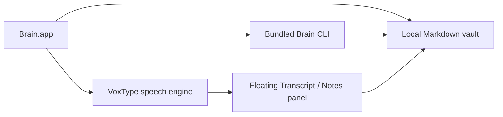

# System design

Brain is a single-owner, local-only plain-Markdown knowledge system.

## Invariants

1. **One local folder is canonical.** All durable knowledge is ordinary
   Markdown below `BRAIN_DATA_ROOT`, defaulting to
   `~/Library/Application Support/Brain/Vault`.
2. **Source and personal data are separate.** `BRAIN_SOURCE_ROOT` contains
   reusable application code, prompts, helpers, and templates and is read-only
   at runtime. Personal data never requires Git.
3. **Plain files remain sufficient.** A user can inspect, search, back up, and
   recover the vault without Brain.app.
4. **Audio stays on the recording Mac.** Meeting and Voice Note audio is never
   ingested into the vault. Only explicitly finalized transcript text is.
5. **The app has fixed local operations.** Capture, knowledge, Process, Digest,
   and Ask use allowlisted local paths and fixed CLI operations; UI text never
   becomes a shell command.

## Local runtime

The installed app bundles the generic Librarian charter, prompts, templates,
and CLI helpers in `Contents/Resources/BrainRuntime`. First setup initializes
the default local vault.

Capture calls `brain ingest --json` with local storage. Text lands atomically
in `inbox/`; image originals are copied to `system/attachments/` with
owner-only permissions and referenced from Markdown. Listing, search, and
document reads allow only approved Markdown roots and reject symlinks,
traversal, and oversized files.

VoxType is the speech owner. Brain may enable the included VoxType login item
and activate a model the user chooses, but leaves VoxType’s shortcut, recording,
transcription, limits, and output behavior under VoxType’s control. A
compatible standalone VoxType installation remains preferred.

Meetings have a floating panel with Transcript and Notes tabs. Closing its
window hides it rather than ending the meeting; reopening returns to the same
in-progress session. Notes are debounced and atomically autosaved locally, so
they are recovered after relaunch. Audio and intermediate transcript state stay
on the recording Mac; final text is written atomically to the local inbox.

## Optional network use

The product has no deployment topology or hosted knowledge service. Networking
is retained only when explicitly configured: VoxType model downloads and app
updates, plus an optional AI provider selected for Librarian or meeting
post-processing. The app discloses when finalized text is sent to that provider.

## Distribution

GitHub distributes source and signed application releases only. A release may
contain reusable runtime assets, but never a personal vault, attachment,
credential, `.git` directory, or machine-specific path.

The repository must pass [PUBLIC_RELEASE.md](PUBLIC_RELEASE.md) before becoming
public. Ignoring personal paths is insufficient if private content already
exists in Git history.
