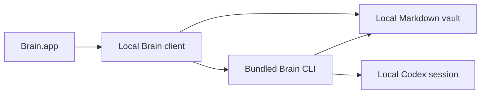
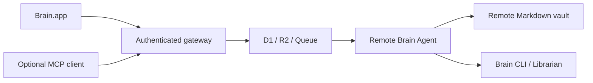

# System design

Brain is a single-owner plain-Markdown knowledge system with two interchangeable
deployment modes: local-only and optional remote.

## Shared invariants

1. **One folder is canonical.** All durable knowledge is ordinary Markdown
   below `BRAIN_DATA_ROOT`. The active mode determines which machine owns it.
2. **Source and personal data are separate.** `BRAIN_SOURCE_ROOT` contains
   reusable application code, prompts, helpers, and templates. It is read-only
   at runtime. Personal data never requires Git.
3. **Mode is explicit.** Brain.app persists `local` or `remote`; capture,
   knowledge, Ask, Process, Digest, and status all resolve through that mode.
   There is no silent local/remote fallback.
4. **Switching is non-destructive.** Selecting another mode changes the active
   target and clears only transient job continuation metadata. Neither vault is
   deleted or merged.
5. **Plain files remain sufficient.** A user can inspect, search, back up, and
   recover the vault without Brain.app or a remote service.
6. **Audio stays local to the recording Mac.** Meeting and Voice Note audio is
   never uploaded. Only an explicitly finalized transcript can enter the active
   Brain vault.

## Local-only mode

The installed app bundles the generic Librarian charter, prompts, templates,
and CLI helpers under `Contents/Resources/BrainRuntime`. On first setup it
initializes the default vault at
`~/Library/Application Support/Brain/Vault`.

Local capture calls `brain ingest --json` with `storage_mode: local`. Text lands
atomically in `inbox/`; image originals are copied to
`system/attachments/` with owner-only permissions and referenced from Markdown.
Knowledge listing, search, and document reads access only allowlisted Markdown
roots and reject symlinks, traversal, and oversized files.

Process, Digest, and Ask are fixed local CLI operations. The app never turns UI
text into a shell command. MCP, Cloudflare, pairing, server credentials, and
remote delivery do not exist in this mode.

## Remote mode

The remote runner owns the canonical vault and all long-running services.
Brain.app stores only an opaque device token in Keychain plus bounded UI,
retry, meeting, and cache state.

D1 owns operational state, R2 owns immutable binary originals, Queues deliver
captures and allowlisted jobs, and Tunnel exposes the runner through an
outbound-only route. None is canonical Markdown knowledge. Remote actions are
closed job kinds, never arbitrary shell execution.

MCP is a gateway capability and therefore remote-only. Optional server
integrations such as Gmail also stay within the remote boundary.

See [remote/README.md](remote/README.md) for the complete optional topology.

## Runtime selection

Brain.app stores:

- `brain.deployment.mode`: `local` or `remote`;
- `brain.local.configuration`: absolute local vault and CLI paths; and
- `brain.remote.instance`: paired gateway metadata.

The local configuration contains no credential. Remote device tokens remain in
Keychain. Mode selection does not erase either configuration, so a user can
switch back deliberately.

## Distribution

GitHub distributes source and signed application releases only. A release may
contain reusable runtime assets, but never a personal vault, attachment,
credential, `.git` directory, or machine-specific path.

The repository must pass [PUBLIC_RELEASE.md](PUBLIC_RELEASE.md) before becoming
public. In particular, ignoring personal paths is insufficient if private
content already exists in Git history.
